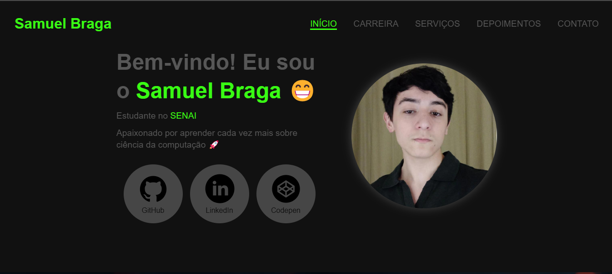

# Meu Site Pessoal


## 📖 Sobre o Projeto

Este repositório contém o código-fonte do meu site pessoal, parte essencial do meu portfólio de desenvolvedor. O site foi pensado para apresentar todas as informações sobre mim, minhas habilidades e projetos, servindo como um cartão de visitas digital e mostrando minha trajetória no desenvolvimento de sistemas.

## 🚀 Tecnologias Utilizadas

- **HTML5**: Estrutura semântica e moderna.
- **CSS3**: Estilização e design responsivo.
- **JavaScript**: Interatividade e animações.

## 🖼️ Estrutura do Site

- **Início**: Uma introdução sobre mim e meus objetivos profissionais.
- **Carreira**: Um resumo da minha trajetória e conquistas na área.
- **Serviços**: Uma lista dos serviços que ofereço, com uma breve descrição.
- **Depoimentos**: Feedback de clientes e parceiros.
- **Contato**: Formas de entrar em contato comigo, com links para redes sociais.

## 🌐 Pré-visualização

 <!-- Substitua 'path/to/image.png' pelo caminho correto da imagem no repositório -->

## 📝 Funcionalidades

- Design responsivo para dispositivos móveis e desktops.
- Estrutura de navegação intuitiva.
- Integração de animações e efeitos visuais em JavaScript.

## 📦 Instalação

Para rodar o projeto localmente:

1. Clone o repositório:

   ```bash
   git clone https://github.com/seu-usuario/seu-repositorio.git
   ```

2. Acesse o diretório do projeto:

   ```bash
   cd seu-repositorio
   ```

3. Abra o arquivo `index.html` no navegador.

## 📌 Próximas Atualizações

- [❌] Implementação de novas animações.
- [❌] Seção de blog para conteúdos sobre desenvolvimento.
- [❌] Formulário de contato com integração de backend.

## 🖊️ Contribuição

Sugestões e melhorias são sempre bem-vindas! Sinta-se à vontade para abrir uma *issue* ou enviar um *pull request*.

## 📫 Contato

Entre em contato comigo em:

- **LinkedIn**: [Meu Perfil](www.linkedin.com/in/samuelbrag4)
- **E-mail**: samuelbraga1306@gmail.com